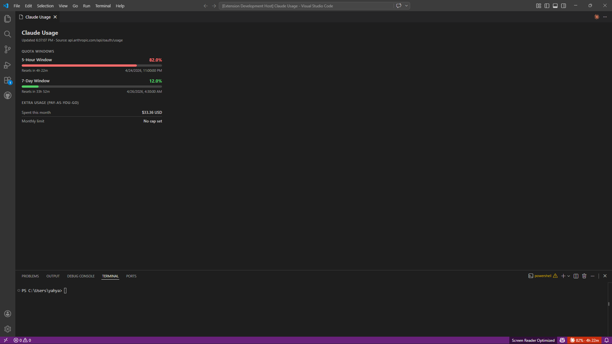
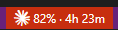
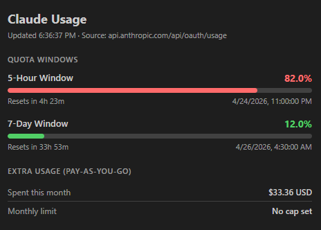

# Claude Code Usage Monitor

A VS Code extension that shows your real-time Claude Code quota usage directly in the status bar — powered by the official Anthropic OAuth usage API.



## How It Works

The extension authenticates using the OAuth token that Claude Code already stores locally at `~/.claude/.credentials.json`. It polls `GET https://api.anthropic.com/api/oauth/usage` every 2 minutes by default (only when the window is focused) and displays the results without any additional login or configuration.

When the API answers `HTTP 429` it also says how long to wait, and the extension waits exactly that long. The block is stored in the cache all windows share, so one window being told to back off stops the others too.

The interval is configurable with `claude-usage-monitor.refreshInterval` (seconds, minimum 60). All windows share one cache, so the interval applies per machine. If the status bar shows `HTTP 429 — Rate limited`, raise it: the usage endpoint has a small hourly budget per account, and every open VS Code window, Claude Code session and other usage tool on the machine draws from the same budget.

## Features

- **Status bar** — shows your 5-hour window utilization % and time until reset, with a warning/error indicator you can render as a background, tinted text, or an emoji
- **Usage panel** — click the status bar to open a full panel with progress bars for every active quota window
- **Extra usage** — displays pay-as-you-go credit spend if enabled on your account
- **Zero config** — reads your existing Claude Code credentials automatically

## Status Bar



```
☁ 69% · 2h 14m
```

- **69%** — percentage of your 5-hour quota used
- **2h 14m** — time until the 5-hour window resets
- Hover for a tooltip with all active quota windows

Levels, with the default thresholds:

- **Normal** — below 60%
- **Warning** — 60–80%
- **Error** — above 80%

How the level is shown is up to you — background, tinted text, an emoji, or nothing at all. See [Choosing the indicator](#choosing-the-indicator).

### Customising the text

The status bar is driven by a format template, `claude-usage-monitor.statusBarFormat`. Windows are addressed as `{5h.…}`, `{7d.…}`, `{extra.…}` (pay-as-you-go), `{max.…}` (whichever window is highest right now) or `{model:<display name>.…}` — the last one resolves against whatever models your account reports, so a new tier is addressable without a new release.

| Template | Renders |
| --- | --- |
| `{icon} {5h.pct} · {5h.reset}` | `12% · 3h 40m` *(default)* |
| `{icon} 5h {5h.pct} · 7d {7d.pct}` | `5h 12% · 7d 2%` |
| `{icon} Fable {model:Fable.pct}` | `Fable 91%` |
| `{icon} {max.name} {max.pct}` | `Fable 91%` — follows whichever window is worst |
| `{icon} {5h.bar} {5h.pct}` | `█░░░░░░░░░ 12%` |
| `{icon} {extra.spent} / {extra.limit}` | `$12.50 / $40.00` |
| `{icon} {5h.pct} · {5h.reset} ({account})` | `12% · 3h 40m (you@example.com)` |

Fields are `.pct`, `.reset`, `.resetTime` (clock time, e.g. `13:27`), `.resetAt`, `.name` and `.bar`, plus `.spent` and `.limit` on the pay-as-you-go window. `{icon}` inserts the Claude mark, `{dot}` the threshold glyph, and `{{`/`}}` escape literal braces.

Set `claude-usage-monitor.resetDisplay` to `clock` or `both` to show `.reset` as the local reset time (`13:27`) instead of a countdown.

`{account}` names the account the window is logged in as — the e-mail, read from Claude Code's own `.claude.json`, which the usage API itself never returns. `{account.user}` is the part before the @, `{account.name}` the display name and `{account.org}` the organisation. Useful when two windows watch two accounts (see [Running more than one account](#running-more-than-one-account)); the tooltip and the panel name the account either way.

A token naming a window your account doesn't report renders empty, and the separator it stranded is removed rather than left dangling — so `{extra.spent} / {extra.limit}` shows just `$7.00` when no monthly cap is set, and pay-as-you-go tokens disappear entirely when credits are off. The same holds for brackets an empty token sat in: `({account})` leaves nothing behind rather than an empty `()`.

The usage panel's **Settings** tab has presets, a live preview, and a checkbox per window for `claude-usage-monitor.statusBarColorFrom`, which drives the indicator from the highest of the windows you check (default: the 5-hour and 7-day windows).

### Choosing the indicator

`claude-usage-monitor.statusBarIndicator` decides how a crossed threshold shows up:

| Value | Effect |
| --- | --- |
| `background` *(default)* | The theme's warning/error background, as before |
| `text` | No background; the text is tinted from `claude-usage-monitor.statusBarColors` |
| `emoji` | No background; a glyph from `claude-usage-monitor.statusBarEmoji` is appended |
| `none` | No signal in the bar — the tooltip, panel and notifications still carry the level |

VS Code allows an extension only two backgrounds, `statusBarItem.warningBackground` and `.errorBackground`, and picks the matching text colour itself. On a theme that sets a bright warning background against a pale warning foreground, the percentage is hard to read and no extension setting can override it. Dropping the background is what hands the colour back — which is what `text` and `emoji` do.

`statusBarColors` takes, per level, either a theme colour id — `editorWarning.foreground`, `charts.red`, `terminal.ansiYellow`, which follow light and dark themes — or a literal CSS colour such as `#e5c100`. `statusBarEmoji` takes any text per level; `normal` is empty by default, because a permanent green dot in the bar is noise rather than information. Both are editable in the panel's **Settings** tab, with a live preview.

The `{dot}` format token places the glyph yourself and works in every mode, so `{icon} {dot} {5h.pct}` pairs a glyph with a background if you want both.

`background` mode paints with VS Code's own tokens rather than colours of ours, so restyling it means editing those tokens. The panel's **Settings** tab shows four fields for them — warning/error background and text — with a colour picker each; clearing a field restores the theme's own colour. They are written to `workbench.colorCustomizations`, which repaints **every** extension's status bar item, not only this one. VS Code resolves these itself and offers no way to scope them to a single item, which is exactly why `text` and `emoji` exist. By hand it looks like this:

```jsonc
"workbench.colorCustomizations": {
  "[Default Dark Modern]": {
    "statusBarItem.warningBackground": "#7A6400",
    "statusBarItem.warningForeground": "#FFFFFF"
  }
}
```

### When a window runs out

At 100% the format is set aside — the only thing that matters then is when you can resume — and the status bar reads `blocked · 47m`, or `Fable blocked · Sun 4:29 AM` for a per-model window. If several are exhausted it shows the one resetting soonest. The panel marks those bars **Exhausted — resets in …**.

### Burn rate — beta, off by default

> **Beta.** Trend lines and run-out estimates are new. They are deliberately conservative, but treat the projections as a rough guide rather than a promise.

Turn on **Track usage history** in the panel's Settings tab, or set `claude-usage-monitor.burnRate` to `true`, and each bar gains a trend line plus a reading like `13 %/hr · out ~11:47 PM` — or `resets first` when the window resets before you can exhaust it. If something really is projected to run out first, a banner names it above the bars.

It stays quiet until it can be accurate: `measuring…` until there is enough movement to fit a line, and `idle` when a window genuinely is not moving.

This is the only feature that records anything. The history is kept locally in VS Code's extension storage, capped at 64 KB (typically ~5 KB), thrown away per window whenever that window resets, and deleted outright when you switch it off.

### Notifications

A red status bar is easy to miss mid-file, so `claude-usage-monitor.notifications` announces threshold crossings:

- `error` *(default)* — at the error threshold, and again when a window is exhausted
- `all` — also at the warning threshold
- `off` — never

Each window notifies **at most once per reset cycle**, escalating only if it gets worse (warning → error → exhausted), so it never repeats on every poll.

## Usage Panel



Click the status bar item (or run **Claude: Show Usage** from the Command Palette) to open a panel showing:

- **5-Hour Window** — your primary rolling quota with a progress bar and reset time
- **7-Day All Models** — weekly quota utilization
- **Per-model weekly windows** — one bar per model limit the API reports (e.g. **7-Day Fable**), parsed generically so new model tiers show up automatically
- **Extra Usage** — pay-as-you-go credits spent this month (when enabled)

## Commands

| Command | Description |
|---------|-------------|
| `Claude: Show Usage` | Open the usage panel |
| `Claude: Refresh Usage` | Force an immediate API poll |

## Requirements

- VS Code 1.104.0 or higher
- Claude Code installed and logged in (so `~/.claude/.credentials.json` exists)
- Internet connection (to reach `api.anthropic.com`)

## Data Source

All data comes from the Anthropic API — the same source Claude Code itself uses for its internal quota display. No local JSONL parsing or file watching is involved.

The credentials file path follows Claude Code's own resolution logic:
1. `claude-usage-monitor.configDir` if set
2. `$CLAUDE_CONFIG_DIR/.credentials.json` if the env var is set
3. `~/.claude/.credentials.json` otherwise

On macOS, recent versions of Claude Code keep the token in the Keychain rather than in `.credentials.json`. When the file is missing, the token is read from the Keychain item Claude Code namespaces per config directory — `Claude Code-credentials-<first 8 hex of sha256(config dir)>` — falling back to the legacy unsuffixed `Claude Code-credentials` for the default directory.

### Running more than one account

Claude Code supports a second account through `CLAUDE_CONFIG_DIR`. That env var does not reach VS Code extensions, though — `claudeCode.environmentVariables` injects only into the Claude Code process, and `terminal.integrated.env.*` only into integrated terminals. Point the extension at the right account per window instead:

```jsonc
// .vscode/settings.json, or the user settings of a separate VS Code install
{
  "claude-usage-monitor.configDir": "~/.claude-work"
}
```

Cached usage, burn-rate history and notification state are namespaced per config directory, so two windows watching two accounts stay independent. The default directory keeps the unnamespaced keys, so nothing is lost on upgrade.

Each window then labels itself with the account it is reporting on: the status bar tooltip and the panel header name it, and `{account}` puts it in the status bar text itself — `12% · 3h 40m (you@work.com)`.

## Privacy

- No data is collected or sent anywhere other than `api.anthropic.com`
- The OAuth token is read from disk and used only for the usage API call
- No telemetry

## License

MIT
